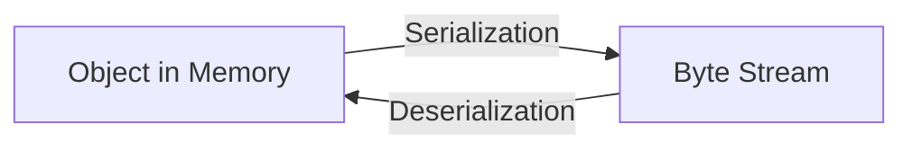

# Java Object Serialization & Deserialization

## Object Lifecycle Basics
When we create the class and its object , so when the program gets excecuted or stops then-(allowing the program to complete its current tasks, release resources, and perform any necessary cleanup operations before exiting. Methods like Thread.interrupt() or using flags to signal threads to stop are common ways to achieve this.) then its objects also gets deleted by itself, Now when we want to class the class without recreating its objects , then we use serialization.

Note - terminates means - implies an abrupt and immediate halt to the execution. This can be achieved using System.exit(), which forcefully terminates the Java Virtual Machine (JVM) and stops the program without necessarily allowing for cleanup.


## Serialization Concepts
### What is Serialization?
Process of converting an object into a byte stream which can be persisted to a disk or database or can be sent through streams..Serialisation is a jvm independent process, meaning the object can be serialised on one platform and deserialised on an entirely different platform.

### What is Deserialization?
Process of reconstructing an object from a byte stream



## Implementation Requirements
The class or program should implement the interface called `java.io.Serializable` or its sub interface called `java.io.Externalizable` interface
1. **Must implement** one of:
   - `java.io.Serializable` (marker interface)
   - `java.io.Externalizable` (for custom control)

2. **Key Classes**:
   - `ObjectOutputStream` → Serialization
   - `ObjectInputStream` → Deserialization
Classes ObjectInputStream and ObjectOutputStream are high level streams that contaon the methods for serializing and deserializing an object.
## Serialization Features
- **Platform Independent**: Serialize on Windows, deserialize on Linux
- **Object Graph Preservation**: Maintains references between objects
- **Version Control**: Using `serialVersionUID`

### Basic Example
```java
import java.io.*;

class Student implements Serializable {
    private static final long serialVersionUID = 1L;
    String name;
    int age;
    
    public Student(String name, int age) {
        this.name = name;
        this.age = age;
    }
}

public class SerializationDemo {
    public static void main(String[] args) {
        // Serialization
        try (ObjectOutputStream oos = new ObjectOutputStream(
                new FileOutputStream("student.ser"))) {
            Student s = new Student("Alice", 20);
            oos.writeObject(s);
        } catch (IOException e) {
            e.printStackTrace();
        }
        
        // Deserialization
        try (ObjectInputStream ois = new ObjectInputStream(
                new FileInputStream("student.ser"))) {
            Student s = (Student) ois.readObject();
            System.out.println(s.name + ", " + s.age);
        } catch (Exception e) {
            e.printStackTrace();
        }
    }
}
```

## Important Considerations
1. **Transient Fields**:
   ```java
   private transient String password;  // Won't be serialized
   ```

2. **Static Fields**: Not serialized (class-level, not object-level)

3. **Inheritance**: Parent class must be serializable if child is serializable

4. **Custom Serialization** (using `Externalizable`):
   ```java
   public void writeExternal(ObjectOutput out) throws IOException {
       // Custom serialization logic
   }
   
   public void readExternal(ObjectInput in) throws IOException, ClassNotFoundException {
       // Custom deserialization logic
   }
   ```

## Security Considerations
- Validate deserialized data (prevent injection attacks)
- Use `readObject()` with `ObjectInputFilter` (Java 9+)
- Avoid serializing sensitive data

## Performance Tips
- For large objects, consider:
  - Compression
  - Custom serialization
  - Alternative formats (JSON, Protocol Buffers)

